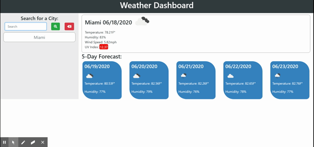

# Weather-Dashboard
[Weather Dashboard]( https://tsgrewing.github.io/Weather-Dashboard/)

## Description
An app that prompt let's the user search for a city and returns the current weather along with the five day forecast. The cities that the user has searched for are saved in local storage until the user clicks the clear history button.

## User Story
AS A traveler
I WANT to see the weather outlook for multiple cities
SO THAT I can plan a trip accordingly

## Functionality
When the user searches for a city, the weather is displayed and the five day forecast is displayed underneath the current conditions. 
The current weather includes a color coded UV index that changes depending on severity.
Cities are saved to local storage and in a list under the search bar. 
Users can click the cities in the history list to easily pull up cities they have searched for in the past.
Users can click the clear history button to clear their search history.

## Demo

